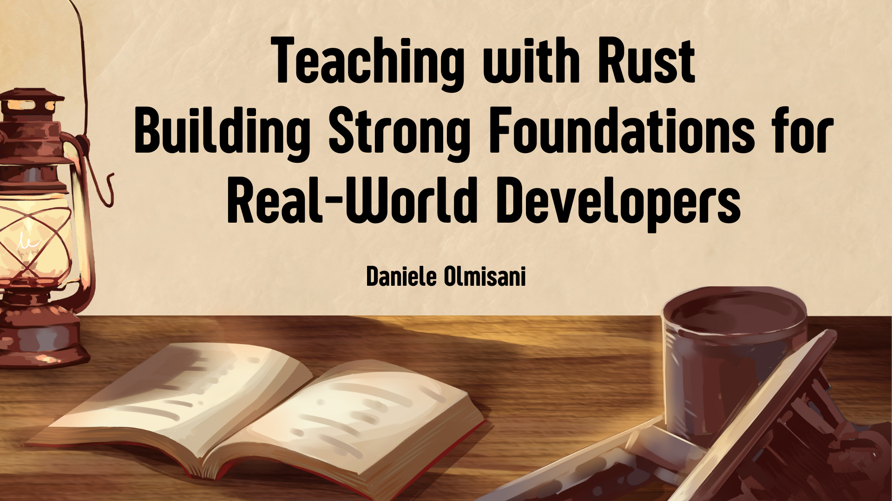
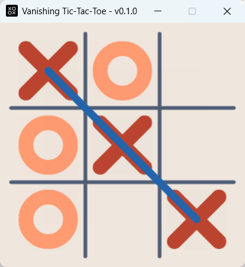

# Teaching with Rust: Building Strong Foundations for Real-World Developers

## Rust vs. Python

Rust is a strong alternative to Python in programming education, offering students a deeper understanding of systems-level concepts like memory management and concurrency. Its strict compiler and clear error messages help form disciplined coding habits early on.

Unlike Python’s high-level abstraction, Rust prepares students for real-world challenges by combining modern language features with safety and performance. This makes it ideal for teaching both foundational principles and advanced topics in a practical, industry-relevant way.

## Vanishing Tic-Tac-Toe a trivial project

In this article we will implementing **Vanishing Tic-Tac-Toe** using Rust. **Vanishing Tic-Tac-Toe** is a twist on the classic Tic-Tac-Toe game, with an added challenge: each player can only have three symbols on the board at any time. The game starts just like the traditional version, with players taking turns placing their symbols (X or O) on a 3x3 grid. However, once a player has placed their third symbol, every new move they make causes their oldest symbol to vanish from the board. This adds a strategic twist, as players must win with shifting pieces and constantly evolving board positions.

### Project Dependencies

The project uses a few carefully chosen dependencies to support graphics rendering, randomness, and platform-specific behavior. Here's a breakdown of the manifest file:

- **`minifb`** provides a simple cross-platform window and framebuffer interface, ideal for rendering pixels directly to a window with minimal overhead.
- **`raqote`** offers a 2D graphics engine for high-quality drawing operations like shapes, text, and anti-aliased lines, complementing the low-level pixel control from `minifb`.
- **`rand`** is used for generating random numbers, useful in gameplay mechanics, procedural generation, or any non-deterministic behavior.

For Windows-specific configurations:

- **`temp-file`** is included as a runtime dependency to handle temporary file creation securely on Windows systems.
- **`winres`** is a build-time dependency used to embed Windows-specific resources (like icons and version info) into the executable during compilation.

This setup ensures that the project remains cross-platform, lightweight, and visually capable, with additional customization for Windows environments.

### Project organization

The project is organized into modular files, each with a clear responsibility, promoting clean architecture and ease of maintenance:

- **`consts.rs`** contains global constants used throughout the project, such as window dimensions, colors, and game-specific settings. Centralizing these values ensures consistency and makes tuning parameters straightforward.

- **`draws.rs`** handles all rendering logic, including drawing the game board, symbols, and interface elements. It uses the `minifb` and `raqote` libraries to manage the pixel buffer and render high-quality 2D graphics.

- **`game.rs`** defines the core game logic, including the rules of Vanishing Tic-Tac-Toe, move validation, state updates, and win condition checks. It maintains the current game state and enforces the _vanishing_ behavior after the third move.

- **`ai.rs`** implements the artificial intelligence for the computer opponent. It provides logic for choosing optimal moves.

- **`main.rs`** serves as the entry point of the application. It initializes the game, handles the main event loop, processes user input, updates the game state, and delegates drawing to the appropriate modules.

This structure keeps the codebase modular, readable, and easy to extend, with each file focusing on a single aspect of the program.

### AI Player Logic

The logic implemented in the **`ai.rs`** module follows a straightforward but effective three-step decision-making process to simulate a challenging yet beatable opponent:

1. **Check for a winning move:** The AI first scans the board to see if there is any available move that would immediately result in a win. If such a position is found, it selects it and plays the move.

2. **Block the opponent's win:** If no winning move is available, the AI checks whether the opponent has a potential winning move on their next turn. If such a threat is detected, the AI prioritizes blocking that move to prevent an immediate loss.

3. **Choose a random move:** If neither a winning opportunity nor an immediate threat exists, the AI falls back to choosing a move at random from the available positions. This adds unpredictability to its behavior.

This logic is intentionally simple to implement and strikes a balance between competence and fallibility. It’s sophisticated enough to challenge the player but not perfect, ensuring that the gameplay remains engaging and fair.

## Incremental organization

This project is well-suited for incremental development across multiple lessons, making it an excellent teaching tool for both Rust programming and game development. It can begin with a foundational structure—setting up the project layout, defining constants, and organizing modules like `game.rs` and `main.rs`. This first step introduces students to modular design and the Rust build system.

In subsequent lessons, the graphics layer can be added using `minifb` and `raqote`, allowing students to visualize the game state and interact with a basic UI. The game can initially support a simple two-player mode, focusing on implementing the rules and turn-based mechanics of Vanishing Tic-Tac-Toe. Once the core gameplay is stable, the AI module can be introduced with a purely random move generator, demonstrating how decision-making can be automated.

Further lessons can evolve the AI with smarter behavior, as described in the `ai.rs` logic, and polish the overall experience with features like win detection, animations, or platform-specific enhancements. This step-by-step approach allows learners to see tangible progress while reinforcing key programming concepts at each stage.

## Where to start

### Project Repository

Project repository is available on GitHub at the following link: [https://github.com/mad4j/rustedbytes-tris](https://github.com/mad4j/rustedbytes-tris)

### Cargo install

With an installed functional Rust toolchain, it is possibile to download and compile the binary project with the following command:

`cargo install rustedbytes-tris`

This will install `rustedbytes-tris` on your path.

### Game commands

Use the following commands to play Vanishing Tic-Tac-Toe:

- `Left` mouse button to select where to put your sign on the grid
- `Right` mouse button or `Space` key to reset the game board
- `Esc` key to close the application

## Conclusion

In conclusion, this project demonstrates how a classic game like Tic-Tac-Toe can be reimagined with simple yet impactful rule changes, such as the vanishing mechanic, to create a fresh and engaging experience. Built using Rust and structured in a clean, modular way, the project showcases how powerful yet accessible the language can be for both gameplay logic and graphical rendering. The AI, while not unbeatable, adds strategic depth and keeps the game enjoyable. Overall, the project is a great example of how to combine creativity, thoughtful design, and modern tooling to build an educational and entertaining application.
